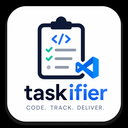
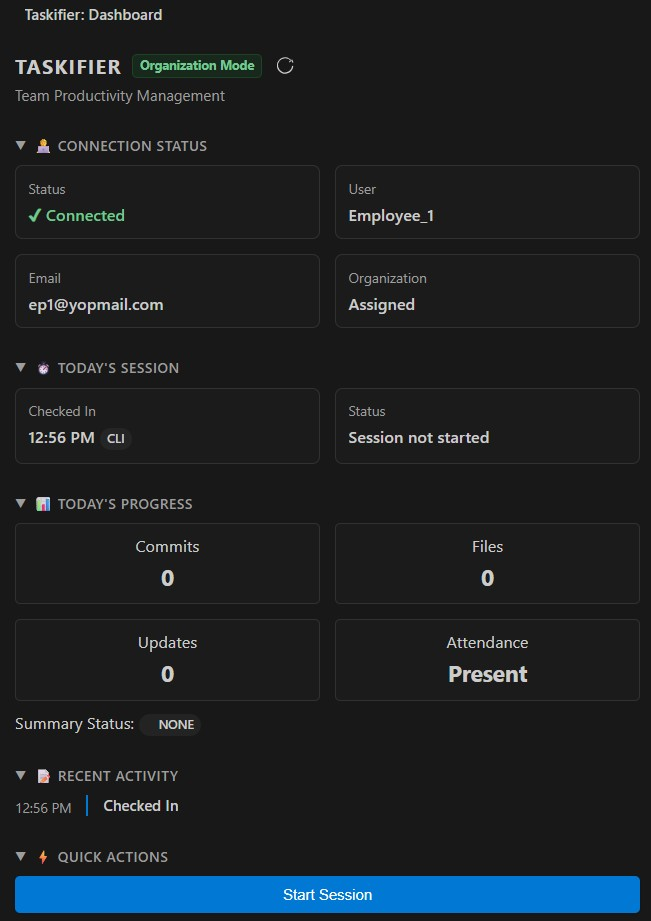
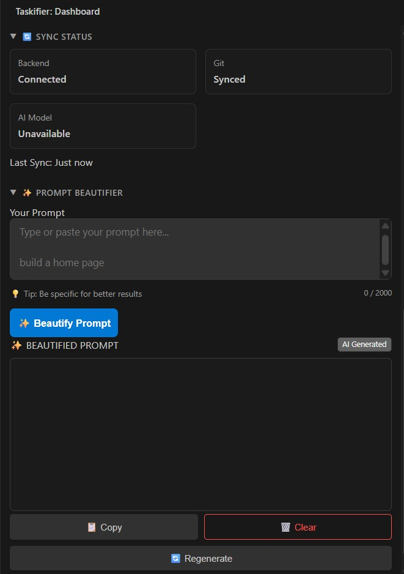
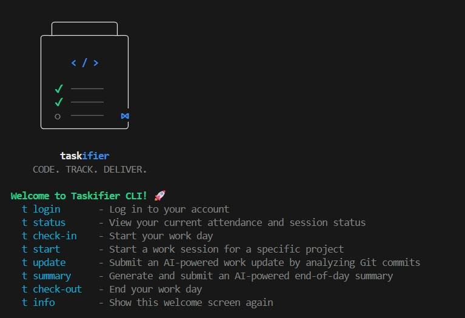

<div align="center">
  <!-- CLI/Logo Image Placeholder -->
  

  <h1>Taskifier</h1>
  <p><b>The AI-powered developer productivity companion for VS Code and the Terminal.</b></p>
</div>

<br />

## 🚀 About Taskifier

**Taskifier** is an intelligent engineering companion built natively for developers. Designed to eliminate the overhead of daily stand-ups and manual progress reporting, Taskifier stays out of your way while keeping your managers and team perfectly synced. 

It helps developers:
* **Track daily work seamlessly** from the editor or the terminal.
* **Generate AI-enhanced work updates** by automatically analyzing local Git commits.
* **Create beautiful, manager-ready daily summaries** of completed work without typing a single paragraph.
* **Improve overall engineering productivity** by automating administrative busywork.

---

## ✨ Features

* **Dual Interfaces:** Seamlessly switch between the rich VS Code Extension Dashboard and our blazing-fast globally accessible CLI (`t`).
* **Personal Mode:** 100% offline, private tracking and reporting. Perfect for individual developers.
* **Prompt Beautifier:** Instantly upgrade your AI prompts by right-clicking text in your editor, or use the dedicated widget in the Personal Dashboard.
* **AI-Powered Summaries:** Transform raw technical commits into professional, polished updates.
* **Git Commit Scanning:** Automatically scans your local repository for today's work—no manual data entry required.
* **Rich Exports:** Save your daily summaries as Markdown, generate PDFs, or send them directly to your email client.

---

## 📸 Screenshots

### VS Code Extension Dashboard
<!-- Dashboard Image Placeholder: Upload your VS Code dashboard screenshot here and update the src path -->
<div align="center">
  
  <p><i>Manage your entire workday without leaving your editor.</i></p>
</div>

<div align="center">
  
  <p><i>Manage your entire workday without leaving your editor.</i></p>
</div>

### Terminal CLI Interface
<!-- CLI Image Placeholder: Upload your CLI screenshot here and update the src path -->
<div align="center">
  
  <p><i>A powerful, interactive terminal experience for power users.</i></p>
</div>

---

## 💻 CLI Commands (`t`)

Taskifier offers a robust, globally accessible CLI. Here is a detailed breakdown of all available commands:

### Core Workflow
| Command | Description |
| :--- | :--- |
| `t info` | Displays the interactive setup wizard, welcome screen, and mode selection. |
| `t login` | Authenticate and connect your Taskifier account (Personal or Organization mode). |
| `t check-in` | Officially start your workday and record your attendance. |
| `t start` | Begin a focused work session. You will be prompted to select a specific project. |
| `t switch` | Seamlessly switch your active work session to a different project without checking out. |
| `t check-out` | End your workday and finalize all active sessions. |

### AI & Reporting
| Command | Description |
| :--- | :--- |
| `t update` | Automatically scan your recent Git commits and use AI to generate a professional mid-day work update. |
| `t view-updates` | Read all of the mid-day updates you have submitted today. |
| `t submit` | Generate an AI-powered end-of-day summary based on all your updates. Use `t submit -r` to review your updates first. |
| `t ai setup` | Configure your preferred AI provider (OpenAI, Anthropic, Gemini, Ollama, OpenRouter). Keys remain 100% local. |

### Utilities
| Command | Description |
| :--- | :--- |
| `t status` | View your current attendance, active session details, and today's overall progress. |
| `t commands` | Display a beautifully formatted list of all available commands. |
| `t logout` | Securely log out and completely clear your session data from the machine. |

---

## ⚡ Using Prompt Beautifier

Taskifier includes a powerful built-in tool to instantly format and improve your prompts before sending them to LLMs (like ChatGPT or Claude). 

1. **Directly in the Text Editor (Right-Click):**
   * Highlight any text inside your code editor.
   * Right-click and select **Taskifier Prompt Beautifier** from the context menu.
   * A Side-by-Side Diff Editor will open, allowing you to review, regenerate, or replace your text seamlessly.

2. **From the Taskifier Dashboard (Personal Mode):**
   * Open the Taskifier extension sidebar.
   * Use the dedicated Prompt Beautifier widget to paste, beautify, and copy your optimized prompts entirely within the panel.

---

## 🛠️ Installation & Quick Start

1. **Install the Extension:** Open VS Code, navigate to the Extensions view (`Ctrl+Shift+X`), search for **Taskifier**, and click Install.
2. **Install the CLI:** Open your terminal and run `npm install -g taskifier-cli`.
3. **Get Started:**
   ```text
   t info      (Select Personal or Organization mode)
   t login     (Authenticate your account)
   t start     (Start your first session)
   t update    (Generate an update from your commits)
   t submit    (Generate your daily summary)
   ```

---

## 🗺️ Roadmap

- [ ] Organization Mode (Team dashboards & Manager reporting)
- [ ] Advanced Analytics & Insights
- [ ] Cloud Synchronization across devices
- [ ] Direct Jira/Linear Integration

---

## 📞 Support & License

* **Issues & Bugs:** [GitHub Issues](https://github.com/Taskifier/taskifier-vscode/issues)
* **Documentation:** [taskifier.com/docs](https://taskifier.com/docs)
* **Contact:** [support@taskifier.com](mailto:support@taskifier.com)

This project is licensed under the **MIT License** - see the LICENSE file for details.
